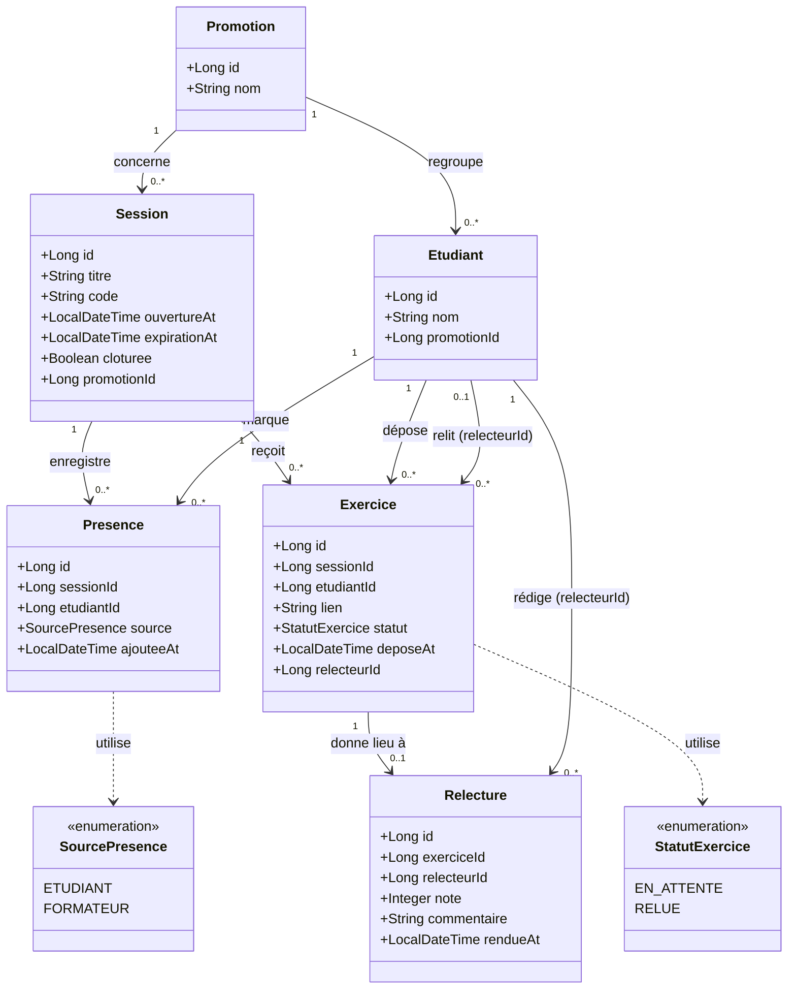

# D2 — Diagramme de classes / modèle de données

**Source** : `docs/CAHIER_DES_CHARGES.md` (sections 4 et 6) et `api/contrat.yaml`.
**Contrainte** : ce diagramme doit correspondre aux migrations Flyway (`backend/src/main/resources/db/migration/V1__init.sql`, etc.).

## Légende

| Élément | Signification |
|---|---|
| `"1" --> "0..*"` | Relation 1-à-plusieurs (un parent, plusieurs enfants) |
| `"0..1" --> "0..*"` | Relation optionnelle (0 ou 1 relecteur pour un exercice) |
| `..>` | Dépendance (utilisation d'une énumération) |
| `<<enumeration>>` | Type énuméré, valeurs fixes |

## Détail des entités

| Entité | Rôle | Points clés |
|---|---|---|
| **Promotion** | Groupe d'étudiants (ex. « L3 Informatique 2025 ») | Aucune clé étrangère |
| **Etudiant** | Étudiant appartenant à une promotion | FK vers `Promotion` |
| **Session** | Session de cours ouverte par le formateur, avec code et expiration | FK vers `Promotion`. Champ `cloturee` pour Q12 (dépôt possible jusqu'à clôture) |
| **Presence** | Présence d'un étudiant à une session | FK vers `Session` et `Etudiant`. Enum `source` (Q14) |
| **Exercice** | Dépôt du lien d'un exercice par un étudiant pour une session | FK vers `Session` et `Etudiant`. `relecteurId` nullable (décision A2 : « relecteur à assigner »). Enum `statut` |
| **Relecture** | Note entière 0–20 + commentaire rendue par un relecteur | FK vers `Exercice` et `Etudiant` (le relecteur) |

## Correspondance avec les règles de gestion

| Règle | Traduction dans le modèle |
|---|---|
| **RG1** (code expire 15 min) | `Session.expirationAt` |
| **RG2** (présence unique par session) | Contrainte `UNIQUE(sessionId, etudiantId)` sur `Presence` |
| **RG5** (un seul relecteur) | `Exercice.relecteurId` est un `Long` unique, pas une collection |
| **RG6** (relecteur parmi les présents, hors auteur) | `Exercice.relecteurId` référence un `Etudiant` ayant une `Presence` à la session, différent de `etudiantId` |
| **RG8** (note entière 0–20) | `Relecture.note : Integer` (validation en service) |
| **RG9** (relecture définitive) | `Relecture.rendueAt` non nul = verrou |
| **RG13** (source ETUDIANT ou FORMATEUR) | Enum `SourcePresence` |
| **RG14** (aucun relecteur → EN_ATTENTE) | `Exercice.relecteurId` nullable + `statut = EN_ATTENTE` |

## Correspondance avec les futures migrations Flyway

Ce diagramme sera traduit en SQL dans `V1__init.sql` :

| Table SQL | Entité Mermaid | Contraintes attendues |
|---|---|---|
| `promotion` | Promotion | PK `id` |
| `etudiant` | Etudiant | PK `id`, FK `promotion_id` |
| `session` | Session | PK `id`, FK `promotion_id`, index sur `code` |
| `presence` | Presence | PK `id`, FK `session_id`, FK `etudiant_id`, UNIQUE(session_id, etudiant_id) |
| `exercice` | Exercice | PK `id`, FK `session_id`, FK `etudiant_id`, FK `relecteur_id` nullable, UNIQUE(session_id, etudiant_id) |
| `relecture` | Relecture | PK `id`, FK `exercice_id` UNIQUE, FK `relecteur_id`, CHECK `note BETWEEN 0 AND 20` |