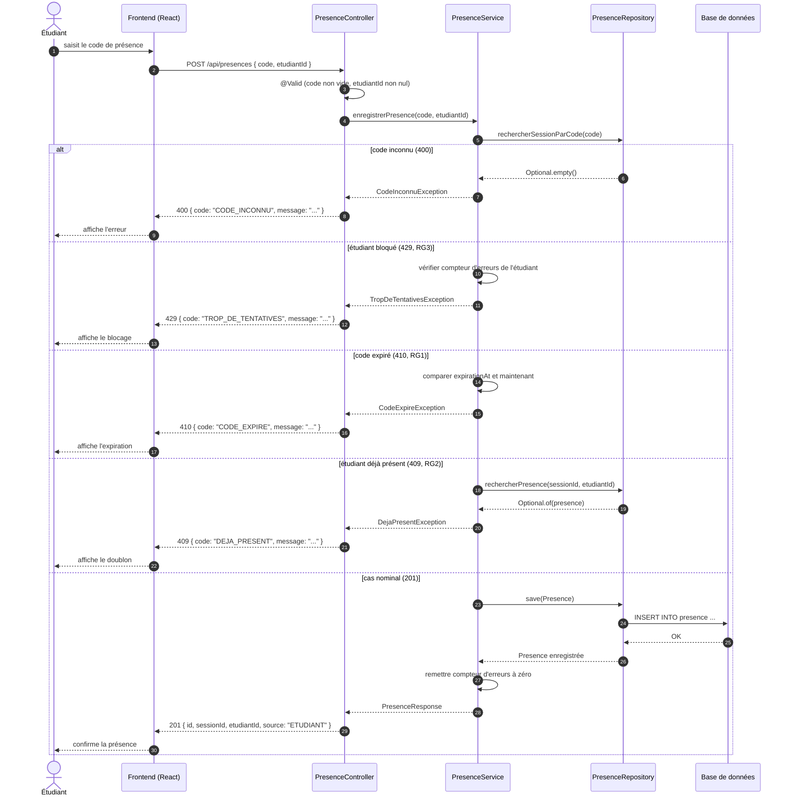

# D3 — Séquence : « marquer sa présence »

**Source** : `api/contrat.yaml` (opération `POST /api/presences`) et `docs/CAHIER_DES_CHARGES.md` (EF2, EF3, EF4, EF5 ; RG1, RG2, RG3).
**Contrainte** : ce diagramme doit correspondre aux codes HTTP du contrat : `201`, `400`, `409`, `410`, `429`.

## Légende

| Élément | Signification |
|---|---|
| `->>` | Message synchrone (appel) |
| `-->>` | Message de retour |
| `alt / else / end` | Branchement conditionnel (cas alternatifs) |
| `autonumber` | Numérote automatiquement les étapes |

## Correspondance avec le contrat d'API

| Cas | Code HTTP | Champ `code` (erreur) | Source |
|---|---|---|---|
| Cas nominal | `201` | — (retourne `{ id, sessionId, etudiantId, source }`) | Contrat imposé |
| Code inconnu | `400` | `CODE_INCONNU` | Contrat imposé (commentaire) |
| Étudiant bloqué | `429` | `TROP_DE_TENTATIVES` | Décision A4, Q4 |
| Code expiré | `410` | `CODE_EXPIRE` | Contrat imposé |
| Étudiant déjà présent | `409` | `DEJA_PRESENT` | Contrat imposé |
| Champ manquant | `400` | (validation) | Contrat imposé |

## Correspondance avec les règles de gestion

| Règle | Traduction dans la séquence |
|---|---|
| **RG1** (code expire 15 min) | Branche `code expiré` → `410 CODE_EXPIRE` |
| **RG2** (présence unique) | Branche `étudiant déjà présent` → `409 DEJA_PRESENT` |
| **RG3** (blocage 5 erreurs → 2 min) | Branche `étudiant bloqué` → `429 TROP_DE_TENTATIVES` |

## Correspondance avec les exigences fonctionnelles

| Exigence | Vérification dans la séquence |
|---|---|
| **EF2** (présence avec code valide) | Cas nominal, `201` + `source: ETUDIANT` |
| **EF3** (code expiré → 410) | Branche `code expiré` |
| **EF4** (déjà présent → 409) | Branche `étudiant déjà présent` |
| **EF5** (blocage → 429) | Branche `étudiant bloqué` |