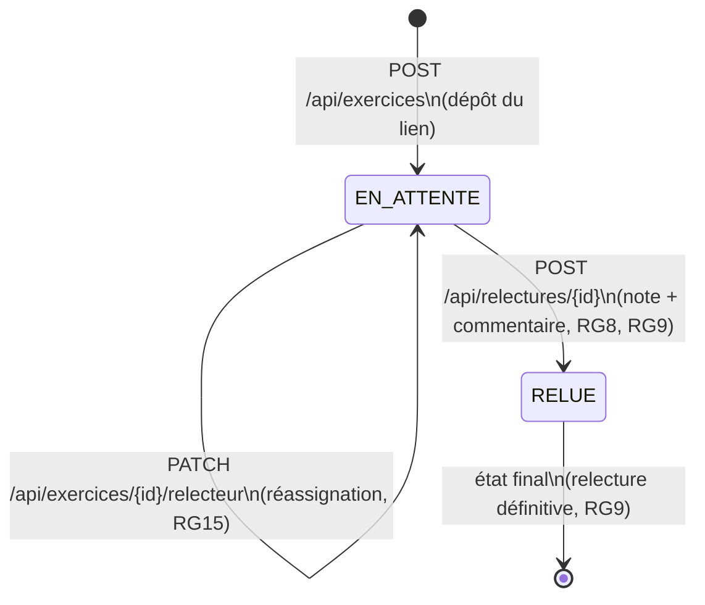

# D4 — États-transitions : cycle de vie d'un exercice (bonus)

**Source** : `docs/CAHIER_DES_CHARGES.md` (sections 4 et 6) et `api/contrat.yaml`.
**Objet** : décrire les états d'un exercice et les transitions autorisées, de son dépôt à sa relecture.



## Légende

| Élément | Signification |
|---|---|
| `[*]` | État initial / final |
| `EN_ATTENTE` | Exercice déposé, en attente de relecture |
| `RELUE` | Exercice relu (note + commentaire rendus) |
| Étiquette de flèche | Action (endpoint) + référence à la règle de gestion |

## Détail des états

| État | Signification | Conditions |
|---|---|---|
| **EN_ATTENTE** | L'exercice a été déposé, mais aucune relecture n'a encore été rendue | Le lien peut être remplacé (RG12). Le relecteur peut être assigné, réassigné ou absent (RG6, RG14, RG15) |
| **RELUE** | Une relecture a été rendue (note + commentaire) | État **définitif** : la relecture ne peut plus être modifiée ni resoumise (RG9) |

## Détail des transitions

| Transition | Déclencheur | Règle de gestion | Exigence |
|---|---|---|---|
| `[*] → EN_ATTENTE` | `POST /api/exercices` (dépôt du lien) | RG6 (assignation au dépôt) | EF7, EF9 |
| `EN_ATTENTE → EN_ATTENTE` (auto-transition) | `PATCH /api/exercices/{id}` (remplacement du lien) | RG12 (tant que la relecture n'a pas commencé) | EF8 |
| `EN_ATTENTE → EN_ATTENTE` (auto-transition) | `PATCH /api/exercices/{id}/relecteur` (réassignation) | RG15 (le formateur peut réassigner) | EF11 |
| `EN_ATTENTE → RELUE` | `POST /api/relectures/{id}` (note + commentaire) | RG8 (note entière 0–20), RG9 (définitive) | EF12 |
| `RELUE → [*]` | — (état final) | RG9 | EF14 |

## Transitions interdites (et pourquoi)

| Transition refusée | Raison | Règle / Exigence |
|---|---|---|
| `RELUE → EN_ATTENTE` | Une relecture rendue est définitive | RG9, EF14 → `409 RELECTURE_DEJA_RENDUE` |
| `RELUE → RELUE` | On ne peut pas resoumettre une relecture déjà rendue | RG9, EF14 → `409 RELECTURE_DEJA_RENDUE` |
| `EN_ATTENTE → RELUE` sans relecteur | Un étudiant ne peut pas relire son propre exercice | RG4, EF13 → `403 AUTO_RELECTURE` |
| `EN_ATTENTE → RELUE` avec note invalide | La note doit être un entier de 0 à 20 | RG8 → `400 NOTE_INVALIDE` |

## Correspondance avec les statuts du modèle de données

Dans le diagramme D2 (`Exercice`), l'attribut `statut` est une énumération :

```
StatutExercice { EN_ATTENTE, RELUE }
```

Les deux valeurs correspondent exactement aux deux états du présent diagramme.