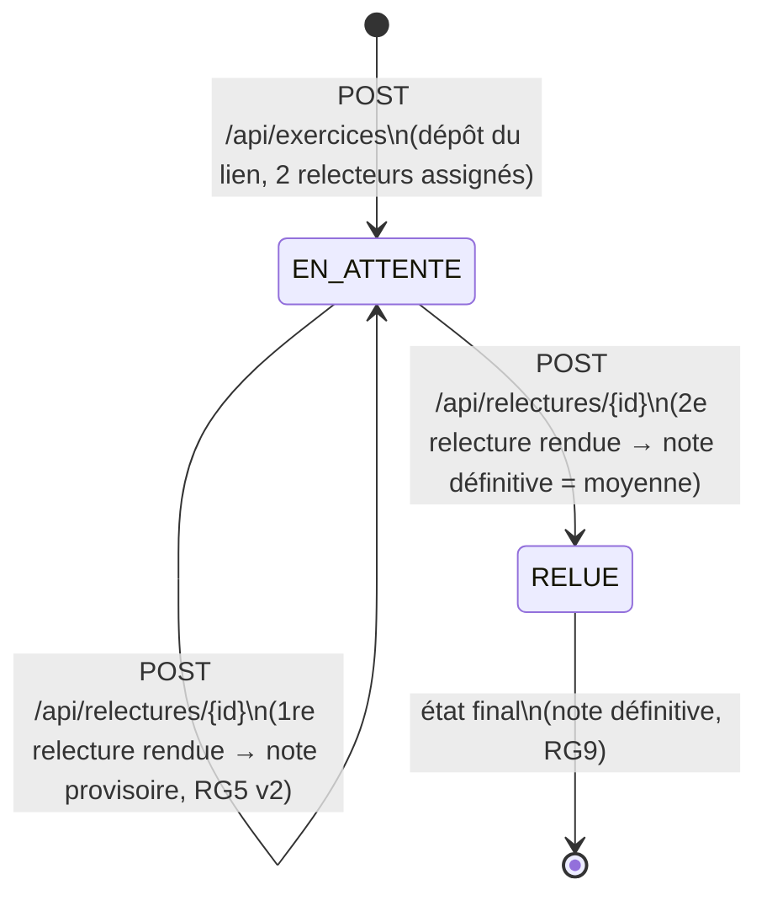

# D4 — États-transitions : cycle de vie d'un exercice (bonus)

**Source** : `docs/CAHIER_DES_CHARGES.md` (sections 4 et 6) et `api/contrat.yaml`.
**Objet** : décrire les états d'un exercice et les transitions autorisées, de son dépôt à sa relecture.



> **v2 (itération 3, décision A9)** : un exercice possède **deux relecteurs**. La 1re relecture rendue ne fait pas passer l'exercice en `RELUE` : sa note est affichée à l'auteur comme **provisoire** (`noteProvisoire = true`). L'exercice passe `RELUE` (note définitive = moyenne des deux) quand les **deux** relecteurs ont rendu.

## Légende

| Élément | Signification |
|---|---|
| `[*]` | État initial / final |
| `EN_ATTENTE` | Exercice déposé, en attente de relecture |
| `RELUE` | Exercice relu (note + commentaire rendus) |
| Étiquette de flèche | Action (endpoint) + référence à la règle de gestion |

## Détail des états

| État | Signification | Conditions |
|---|---|---|
| **EN_ATTENTE** | L'exercice a été déposé, mais toutes ses relectures ne sont pas encore rendues | Le lien peut être remplacé tant qu'aucune relecture n'a commencé (RG12). Un relecteur peut être réassigné tant qu'il n'a pas rendu ; la seconde assignation peut être complétée (RG6 v2, RG14, RG15). Une note rendue sur un seul relecteur reste affichée comme provisoire (RG5 v2) |
| **RELUE** | Les **deux** relectures ont été rendues ; la note définitive est la moyenne des deux | État **définitif** : les relectures individuelles ne peuvent plus être modifiées ni resoumises (RG9) |

## Détail des transitions

| Transition | Déclencheur | Règle de gestion | Exigence |
|---|---|---|---|
| `[*] → EN_ATTENTE` | `POST /api/exercices` (dépôt du lien) | RG6 v2 (2 relecteurs assignés au dépôt) | EF7, EF9 |
| `EN_ATTENTE → EN_ATTENTE` (auto-transition) | `PATCH /api/exercices/{id}` (remplacement du lien) | RG12 (tant que la relecture n'a pas commencé) | EF8 |
| `EN_ATTENTE → EN_ATTENTE` (auto-transition) | `PATCH /api/exercices/{id}/relecteur` (réassignation ou complément) | RG15 (le formateur peut réassigner/compléter) | EF11 |
| `EN_ATTENTE → EN_ATTENTE` (auto-transition) | `POST /api/relectures/{id}` (1re des 2 relectures rendue) | RG5 v2 (note provisoire en attendant la 2e) | EF12, EF15 |
| `EN_ATTENTE → RELUE` | `POST /api/relectures/{id}` (2e relecture rendue) | RG8 (note entière 0–20), RG9 (définitive), RG5 v2 (moyenne des deux) | EF12 |
| `RELUE → [*]` | — (état final) | RG9 | EF14 |

## Transitions interdites (et pourquoi)

| Transition refusée | Raison | Règle / Exigence |
|---|---|---|
| `RELUE → EN_ATTENTE` | Les relectures rendues sont définitives | RG9, EF14 → `409 RELECTURE_DEJA_RENDUE` |
| `RELUE → RELUE` | On ne peut pas resoumettre une relecture déjà rendue (par relecteur) | RG9, EF14 → `409 RELECTURE_DEJA_RENDUE` |
| `EN_ATTENTE → RELUE` après la 1re relecture seulement | Un seul relecteur rendu ne suffit pas : la note reste provisoire | RG5 v2, EF12 → l'exercice reste `EN_ATTENTE` |
| `EN_ATTENTE → RELUE` sans relecteur assigné | Un étudiant ne peut pas relire son propre exercice / il faut des relecteurs assignés | RG4, EF13 → `403 AUTO_RELECTURE` |
| `EN_ATTENTE → RELUE` avec note invalide | La note doit être un entier de 0 à 20 | RG8 → `400 NOTE_INVALIDE` |

## Correspondance avec les statuts du modèle de données

Dans le diagramme D2 (`Exercice`), l'attribut `statut` est une énumération :

```
StatutExercice { EN_ATTENTE, RELUE }
```

Les deux valeurs correspondent exactement aux deux états du présent diagramme.