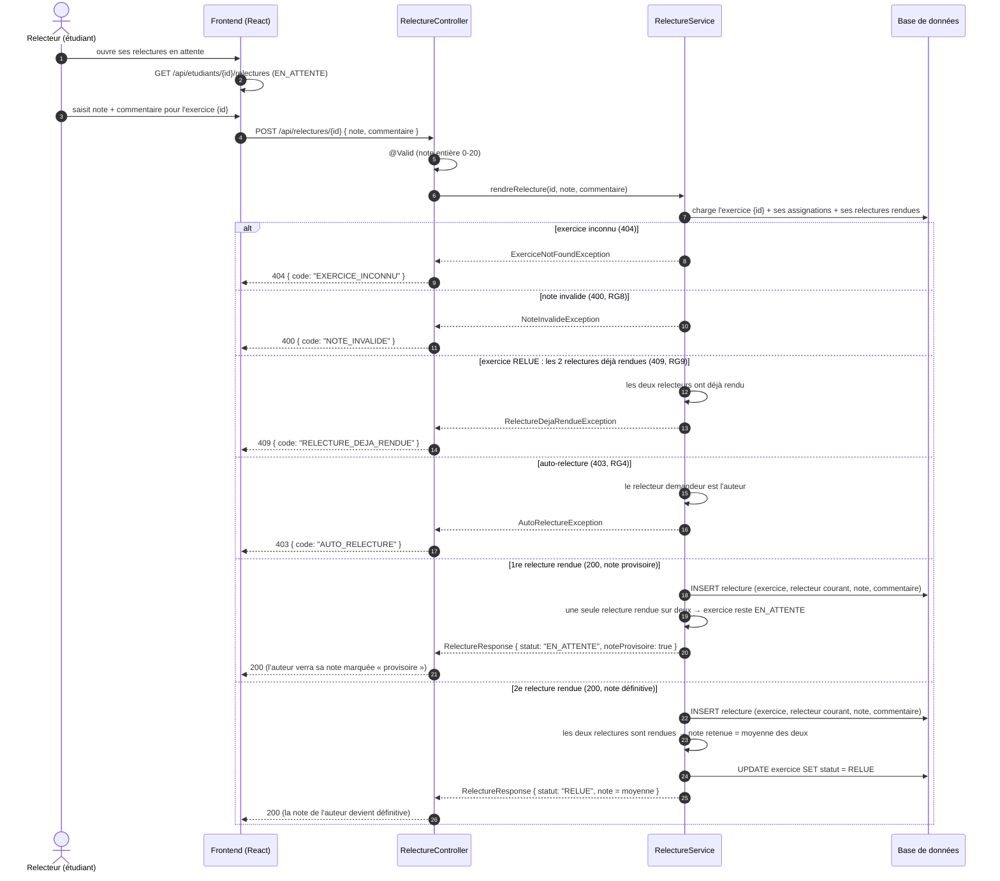

# D5 — Séquence : « rendre une relecture » (v2 : deux relecteurs)

**Source** : `api/contrat.yaml` (opération `POST /api/relectures/{id}`) et `docs/CAHIER_DES_CHARGES.md` (EF12, EF13, EF14, EF15 ; RG5 v2, RG8, RG9, décision A9, A10).
**v2 (itération 3)** : chaque exercice possède **deux relecteurs distincts** (RG5 v2, décision A9). La 1re relecture rendue laisse l'exercice `EN_ATTENTE` avec note **provisoire** ; la 2e rendue fait passer l'exercice `RELUE` et fixe la note définitive (moyenne des deux).

## Identification du relecteur (décision A10)

L'opération imposée `POST /api/relectures/{id}` ne transporte pas l'identité du relecteur dans son corps (`{ note, commentaire }`) et le projet n'a pas d'authentification. Le backend détermine donc le relecteur comme **le relecteur assigné de l'exercice qui n'a pas encore rendu sa relecture** :

- si **aucun** des deux relecteurs n'a rendu → c'est le premier assigné qui rend ;
- si **un seul** a rendu → tout nouvel appel porte sur le second (le premier serait de toute façon exclu : sa relecture existe déjà) ;
- si **les deux** ont rendu → `409 RELECTURE_DEJA_RENDUE` (RG9).

`GET /api/etudiants/{id}/relectures` n'expose à un étudiant que les exercices qu'il doit encore relire, ce qui rend ce flux déterministe côté interface.

## Correspondance avec le contrat d'API

| Cas | Code HTTP | Champ `code` (erreur) | Source |
|---|---|---|---|
| 1re relecture rendue | `200` | — (`statut: "EN_ATTENTE"`, note provisoire) | Contrat imposé + décision A9 |
| 2e relecture rendue (exercice `RELUE`) | `200` | — (`statut: "RELUE"`, note = moyenne) | Contrat imposé + décision A9 |
| Exercice inconnu | `404` | `EXERCICE_INCONNU` | Contrat imposé |
| Note hors bornes / non entière | `400` | `NOTE_INVALIDE` | Contrat imposé, RG8 |
| Auto-relecture | `403` | `AUTO_RELECTURE` | Contrat imposé, RG4 |
| Les deux relectures déjà rendues | `409` | `RELECTURE_DEJA_RENDUE` | Contrat imposé, RG9 |

## Correspondance avec les règles de gestion

| Règle | Traduction dans la séquence |
|---|---|
| **RG4** (pas d'auto-relecture) | Branche `auto-relecture` → `403 AUTO_RELECTURE` |
| **RG5 v2** (deux relecteurs, moyenne) | Branches « 1re relecture » (provisoire) et « 2e relecture » (moyenne, `RELUE`) |
| **RG8** (note entière 0–20) | Branche `note invalide` → `400 NOTE_INVALIDE` |
| **RG9** (relecture définitive) | Branche « les deux rendues » → `409 RELECTURE_DEJA_RENDUE` ; la relecture individuelle rendue n'est plus modifiable |

## Correspondance avec les exigences fonctionnelles

| Exigence | Vérification dans la séquence |
|---|---|
| **EF12** (le relecteur note et commente) | Cas nominaux `200` ; exercice `RELUE` quand les deux ont rendu |
| **EF13** (pas d'auto-relecture) | Branche `403 AUTO_RELECTURE` |
| **EF14** (relecture définitive) | Branche `409 RELECTURE_DEJA_RENDUE` |
| **EF15** (note + provisoire, sans identité) | 1re relecture → `noteProvisoire: true` exposé à l'auteur ; aucun champ relecteur dans les réponses |
